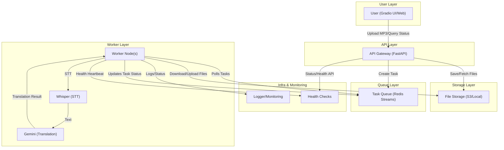
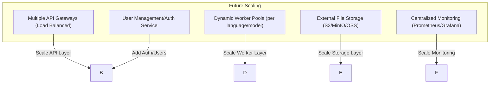

# Multilingual Storybook Translation System


## Overview

This project is a distributed, fault-tolerant system for translating storybook audio and text into multiple languages. It uses Whisper for speech-to-text (STT), Google Gemini 2.0 Flash for translation, and Redis Streams for robust task queueing and management. The system includes a consolidated FastAPI backend and a Gradio web interface for easy interaction.

## Features
- **Batch translation** of storybook audio and text into multiple languages
- **Speech-to-text** using local Whisper model
- **STT accuracy check** using Word Error Rate (WER) against provided reference text
- **Automatic fallback** to reference text if STT is inaccurate (WER > 0.3)
- **Translation** using Google Gemini 2.0 Flash (faster and more accurate than traditional MT models)
- **Task queue** with Redis Streams for reliability and fault tolerance
- **Distributed worker support** with memory-aware scheduling
- **Task management**: create, query, cancel, and retry tasks
- **Gradio web UI** for easy file upload, status tracking, and result viewing
- **Consolidated API** - single FastAPI backend handling all operations

## Architecture
### **Current Architecture**



---

### **Future Scalability Directions**


```
┌─────────────────┐    ┌─────────────────┐    ┌─────────────────┐
│   API Gateway   │    │  Load Balancer  │    │   Web Client    │
│   (FastAPI)     │    │    (future)     │    │   (Gradio UI)   │
└─────────────────┘    └─────────────────┘    └─────────────────┘
         │                       │                       │
         └───────────────────────┼───────────────────────┘
                                 │
              ┌─────────────────────────────────────┐
              │        Translation Service          │
              │         (Core Business)             │
              └─────────────────────────────────────┘
                                 │
        ┌────────────────────────┼────────────────────────┐
        │                        │                        │
┌─────────────────┐    ┌─────────────────┐    ┌─────────────────┐
│  Task Manager   │    │  Worker Nodes   │    │  Streams Queue  │
│   (Scheduler)   │    │   (Processors)  │    │   (MQ)          │
└─────────────────┘    └─────────────────┘    └─────────────────┘
        │                        │                        │
        └────────────────────────┼────────────────────────┘
                                 │
              ┌─────────────────────────────────────┐
              │        Infrastructure Layer         │
              │  Redis | PostgreSQL | File System   │
              └─────────────────────────────────────┘
```

- **Gradio UI**: Uploads ZIP files, manages tasks, and displays results
- **FastAPI Backend**: Handles API requests, manages tasks, and processes translations
- **Redis Streams**: Stores and distributes translation tasks
- **Worker Nodes**: Run Whisper STT, check accuracy, translate with Gemini, and report results

## Setup

### 1. Install Dependencies
```bash
pip install -r requirements.txt
```
Install ffmpeg

#### macOS：
```bash
brew install ffmpeg
```

Ubuntu/Debian：
```bash
sudo apt-get update
sudo apt-get install ffmpeg
```
Windows：
- Windows: [ffmpeg 官网下载](https://ffmpeg.org/download.html)
- conda: `conda install -c conda-forge ffmpeg`

### 2. Set Environment Variables
```bash
export GOOGLE_API_KEY="your_google_api_key_here"
```

### 3. Start Redis Server
```bash
redis-server
```

### 4. Run script(Local dev). In production, you should use docker-compose
```bash
./run.sh
```
### 5. Run worker
```
  python workers/worker.py
```
## Usage

### 1. Prepare Input Files
- **ZIP file** containing:
  - Audio files (`.mp3` or `.wav`), named as `1.mp3`, `2.mp3`, etc.
  - A JSON file (e.g., `text.json`) with the reference text:
    ```json
    {
      "1": "Tilly, a little fox, loved her bright red balloon...",
      "2": "But one windy day, the balloon slipped away!..."
    }
    ```

### 2. Upload and Translate
- Open the Gradio UI (default: http://localhost:7860)
- Upload your ZIP file
- Select source and target languages
- Submit and monitor the task
- Download or view results when complete

### 3. Task Management
- Query task status by ID
- Cancel tasks
- List all tasks by status

## How It Works
- **STT**: Each audio file is transcribed with Whisper
- **Accuracy Check**: WER is computed between STT output and reference text
  - If WER > 0.3, the reference text is used for translation
- **Translation**: Text is translated into all selected target languages using Gemini 2.0 Flash
- **Results**: All translations and metadata are stored and can be queried/downloaded

## API Endpoints
- `POST /upload` — Upload files and create a translation task
- `GET /task/{task_id}` — Query task status
- `GET /task/{task_id}/results` — Get translation results
- `POST /task/{task_id}/cancel` — Cancel a task
- `GET /tasks` — List all tasks (optionally filter by status)
- `GET /health` — Health check endpoint

## Key Improvements

### 1. **Consolidated API Logic**
- Single FastAPI application handling all operations
- Removed duplicate code and conflicting endpoints
- Cleaner separation of concerns

### 2. **Gemini 2.0 Flash Integration**
- Replaced OpenAI GPT-4 and MarianMT with Google Gemini 2.0 Flash
- Faster translation processing
- Better translation quality
- More cost-effective than GPT-4

### 3. **Enhanced Error Handling**
- Better logging and error reporting
- Graceful handling of translation failures
- Memory usage monitoring

### 4. **Improved User Experience**
- Better Gradio interface with clearer instructions
- Enhanced file type validation
- Improved status reporting

## Advanced
- **Distributed Workers**: Run multiple `translation_worker.py` processes on different machines for scalability
- **Memory-Aware Scheduling**: Workers check system memory before claiming new tasks
- **Fault Tolerance**: Tasks are never lost; failed tasks can be retried

## Notes
Swagger Openapi: http://localhost:8000/docs

- Make sure you download Whisper,ffmpeg on first run (ensure sufficient disk space)
- You need a Google API key for Gemini 2.0 Flash
- For production, secure the API and Gradio endpoints
- The system supports multiple languages: English, Chinese (Simplified/Traditional), Japanese, Korean, French, German, Spanish
- 
分布式任务处理: 基于Redis Stream的消息队列
智能STT校验: 原始文本与语音识别结果的智能对比和纠错
故障容错: 任务重试、故障转移、死信队列
资源感知: 内存监控、负载均衡
高效编码: 紧凑的多语言文本存储格式
## License
MIT 
