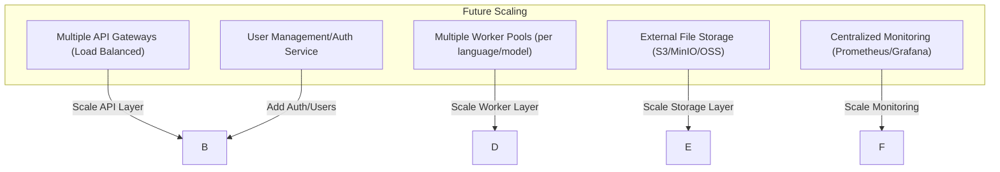
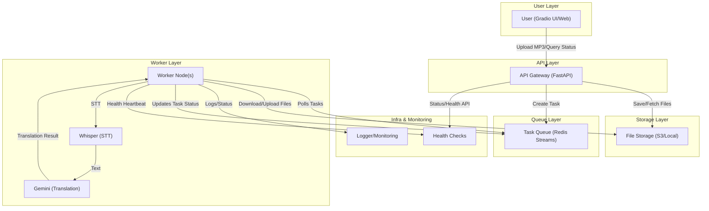

# Multilingual Story Translation System - Refactored

## Overview

This is a completely refactored, distributed, fault-tolerant system for translating storybook audio and text into multiple languages. The system has been redesigned with proper separation of concerns, centralized configuration, and robust error handling.

## Architecture

### **Future Scalability Directions**


```
┌─────────────────┐    ┌─────────────────┐    ┌─────────────────┐
│   API Gateway   │    │  Load Balancer  │    │   Web Client    │
│   (FastAPI)     │    │    (future)     │    │   (Gradio UI)   │
└─────────────────┘    └─────────────────┘    └─────────────────┘
         │                       │                       │
         └───────────────────────┼───────────────────────┘
                                 │
              ┌─────────────────────────────────────┐
              │        Translation Service          │
              │         (Core Business)             │
              └─────────────────────────────────────┘
                                 │
        ┌────────────────────────┼────────────────────────┐
        │                        │                        │
┌─────────────────┐    ┌─────────────────┐    ┌─────────────────┐
│  Task Manager   │    │  Worker Nodes   │    │  Streams Queue  │
│   (Scheduler)   │    │   (Processors)  │    │   (MQ)          │
└─────────────────┘    └─────────────────┘    └─────────────────┘
        │                        │                        │
        └────────────────────────┼────────────────────────┘
                                 │
              ┌─────────────────────────────────────┐
              │        Infrastructure Layer         │
              │  Redis | PostgreSQL | File System   │
              └─────────────────────────────────────┘
```
### Core Components

1. **API Gateway (FastAPI)**
   - RESTful API endpoints
   - Request validation and routing
   - Health checks and monitoring

2. **Task Manager (Core Business Logic)**
   - Task creation and management
   - Redis Streams integration
   - Fault tolerance with PEL/XCLAIM

3. **Translation Service (Core Business Logic)**
   - STT processing with Whisper
   - Translation with Google Gemini 2.0 Flash
   - Text validation and WER calculation

4. **Worker Nodes (Standalone Processes)**
   - Distributed task processing
   - Resource monitoring
   - Heartbeat and health reporting

5. **Infrastructure Layer**
   - Redis client with connection pooling
   - Storage manager (local + S3)
   - Centralized configuration

6. **UI Layer (Gradio)**
   - Web interface for task management
   - Real-time status monitoring
   - System health dashboard

### Data Flow

```
[User] → [Gradio UI] → [FastAPI] → [Task Manager] → [Redis Streams] → [Worker] → [Translation Service]
                                                                                    ↓
[Results] ← [Task Manager] ← [Redis] ← [Worker] ← [Storage Manager]
```

### **Current Architecture**



---

### **Future Scalability Directions**


## Key Improvements

### 1. **Eliminated Duplicate Code**
- Single implementation of each function across the system
- Centralized task management logic
- Unified Redis client with connection pooling
- Consistent error handling and logging

### 2. **Proper Separation of Concerns**
- **API Layer**: Only handles HTTP requests/responses
- **Core Layer**: Business logic for tasks and translation
- **Infrastructure Layer**: Data storage and external services
- **Worker Layer**: Standalone processing units
- **UI Layer**: User interface only

### 3. **Fault Tolerance**
- Redis Streams with consumer groups
- Pending Entries List (PEL) for failed tasks
- XCLAIM for task recovery from dead workers
- Automatic retry with configurable limits
- Health checks and resource monitoring

### 4. **Scalability**
- Separate worker processes/containers
- Resource-aware task scheduling
- Memory and CPU monitoring
- Horizontal scaling support

### 5. **Configuration Management**
- Environment-specific settings
- Centralized configuration with validation
- Support for development/staging/production

## Directory Structure

```
translation_system/
├── api/                    # API Gateway
│   ├── main.py            # FastAPI application
│   └── routes/
│       ├── tasks.py       # Task management endpoints
│       └── health.py      # Health check endpoints
├── core/                   # Business Logic
│   ├── models.py          # Data models
│   ├── task_manager.py    # Task management
│   └── translation_service.py  # Translation logic
├── infrastructure/         # Infrastructure Layer
│   ├── redis_client.py    # Redis client
│   └── storage.py         # File storage
├── workers/               # Worker Processes
│   └── worker.py          # Translation worker
├── utils/                 # Utilities
│   ├── config.py          # Configuration
│   └── logger.py          # Logging
├── ui/                    # User Interface
│   └── gradio_interface.py # Gradio web UI
├── config.py              # Main configuration
├── requirements.txt       # Dependencies
├── run_refactored.sh      # Startup script
└── README_REFACTORED.md   # This file
```

## Setup

### 1. Install Dependencies
```bash
pip install -r requirements.txt
```

### 2. Environment Configuration
Create a `.env` file:
```bash
# Required
GOOGLE_API_KEY=your_google_api_key_here

# Optional (with defaults)
ENVIRONMENT=development
REDIS_HOST=localhost
REDIS_PORT=6379
API_HOST=0.0.0.0
API_PORT=8000
```

### 3. Start Redis Server
```bash
redis-server
```

### 4. Start the System
```bash
# Option 1: Use the startup script
chmod +x run_refactored.sh
./run_refactored.sh

# Option 2: Start components manually
# Terminal 1: API
python main.py

# Terminal 2: UI
python ui/gradio_interface.py

# Terminal 3: Worker
python workers/worker.py
```

## API Endpoints

### Task Management
- `POST /api/v1/tasks/` - Create translation task
- `GET /api/v1/tasks/{task_id}` - Get task status
- `GET /api/v1/tasks/{task_id}/results` - Get task results
- `POST /api/v1/tasks/{task_id}/cancel` - Cancel task
- `POST /api/v1/tasks/{task_id}/retry` - Retry failed task
- `GET /api/v1/tasks/` - List all tasks
- `POST /api/v1/upload/` - Upload ZIP and mp3 file

### Health & Monitoring
- `GET /api/v1/health/` - System health check
- `GET /api/v1/health/redis` - Redis health check
- `GET /api/v1/health/storage` - Storage health check
- `GET /api/v1/health/workers` - Worker status
- `GET /api/v1/health/system` - System resources
- `GET /api/v1/health/metrics` - System metrics

## Usage

### 1. Prepare Input Files
Create a ZIP file containing:
- **MP3 audio files** (e.g., `1.mp3`, `2.mp3`)
- **JSON file** with reference text:
```json
{
  "1": "Tilly, a little fox, loved her bright red balloon...",
  "2": "But one windy day, the balloon slipped away!..."
}
```

### 2. Upload and Translate
1. Open the Gradio UI (http://localhost:7860)
2. Upload your ZIP file
3. Select source and target languages
4. Submit and monitor the task
5. Download or view results when complete

### 3. Task Management
- Query task status by ID
- Cancel tasks
- Retry failed tasks
- List all tasks by status
- Monitor system health

## Configuration Options

### Environment Variables
- `ENVIRONMENT`: development/staging/production
- `DEBUG`: Enable debug mode
- `LOG_LEVEL`: Logging level (INFO/WARNING/ERROR)
- `WORKER_MEMORY_LIMIT`: Memory threshold for workers
- `TASK_RETRY_LIMIT`: Maximum retry attempts
- `WER_THRESHOLD`: Word Error Rate threshold

### File Processing
- **Audio Formats**: Only MP3 supported
- **Max File Size**: 100MB (configurable)
- **Storage**: Local filesystem or S3

### Translation
- **STT Model**: Whisper (base/medium/large)
- **Translation**: Google Gemini 2.0 Flash only
- **Languages**: English, Chinese, Japanese, Korean, French, German, Spanish

## Fault Tolerance Features

### 1. **Task Recovery**
- Failed workers are detected via heartbeat timeout
- Orphaned tasks are automatically claimed by healthy workers
- Tasks are retried up to the configured limit

### 2. **Resource Management**
- Memory usage monitoring
- CPU usage tracking
- Automatic task scheduling based on resource availability

### 3. **Data Persistence**
- Redis Streams for task queue
- Redis hashes for task metadata
- File storage for audio and results

### 4. **Health Monitoring**
- Worker heartbeat system
- System resource monitoring
- Service health checks
- Comprehensive metrics collection

## Deployment

### Development
```bash
./run_refactored.sh
```

### Production (Kubernetes)
```yaml
# Example deployment
apiVersion: apps/v1
kind: Deployment
metadata:
  name: translation-api
spec:
  replicas: 3
  selector:
    matchLabels:
      app: translation-api
  template:
    metadata:
      labels:
        app: translation-api
    spec:
      containers:
      - name: api
        image: translation-api:latest
        ports:
        - containerPort: 8000
        env:
        - name: GOOGLE_API_KEY
          valueFrom:
            secretKeyRef:
              name: translation-secrets
              key: google-api-key
```

### Docker
```dockerfile
FROM python:3.11-slim
WORKDIR /app
COPY . .
RUN pip install --no-cache-dir -r requirements.txt
CMD ["python", "main.py"]
```

## Monitoring and Logging

### Logging
- Structured logging with consistent format
- Environment-specific log levels
- File logging in production

### Metrics
- Task statistics (pending, processing, completed, failed)
- System resources (CPU, memory, disk)
- Worker status and performance
- API response times

### Health Checks
- Redis connectivity
- Storage availability
- Worker health
- System resources

## Troubleshooting

### Common Issues

1. **Redis Connection Failed**
   - Check if Redis server is running
   - Verify connection settings in config

2. **Worker Not Processing Tasks**
   - Check worker logs for errors
   - Verify system resources
   - Check Redis stream configuration

3. **Translation Failures**
   - Verify Google API key
   - Check network connectivity
   - Review error logs

4. **File Upload Issues**
   - Ensure files are MP3 format
   - Check file size limits
   - Verify storage permissions

### Debug Mode
Set `DEBUG=true` in environment to enable:
- Detailed error messages
- API documentation at `/docs`
- Verbose logging

## Migration from Old System

### Breaking Changes
- API endpoints have changed
- Only MP3 files supported
- Only Gemini translation provider
- New configuration system
- Different startup process

### Migration Steps
1. Update file formats to MP3
2. Update API calls to new endpoints
3. Set up new configuration
4. Use new startup script

## Contributing

1. Follow the established architecture
2. Add tests for new features
3. Update documentation
4. Use the centralized logging and configuration

## License

This project is licensed under the MIT License.

# System Design Document / 设计文档
Swagger: http://localhost:8000/docs
## 1. Overview / 概述
This system is a distributed, scalable audio translation platform. It leverages FastAPI for the API Gateway, Redis Streams for task queueing and state, Whisper for speech-to-text, Gemini for translation, and S3/local storage for files. The architecture is modular, fault-tolerant, and designed for easy scaling and maintenance.

本系统是一个分布式、可扩展的音频翻译平台。采用 FastAPI 作为 API 网关，Redis Streams 进行任务队列和状态管理，Whisper 进行语音转文本，Gemini 进行翻译，S3/本地存储文件。架构模块化，具备容错性，易于扩展和维护。

## 2. Architecture / 架构


### Modules / 模块
- **API Gateway (FastAPI)**: Handles HTTP requests, task creation, status queries, and health checks. 负责 HTTP 请求、任务创建、状态查询和健康检查。
- **Task Manager**: Manages task lifecycle, status, and retries using Redis Streams. 使用 Redis Streams 管理任务生命周期、状态和重试。
- **File Manager**: Handles file uploads/downloads to S3 or local storage. 负责文件上传/下载到 S3 或本地存储。
- **Worker Nodes**: Poll Redis Streams, process tasks (transcribe & translate), and update results. 轮询 Redis Streams，处理任务（转录和翻译），并更新结果。
- **Translation Service**: Integrates Whisper (STT) and Gemini (translation). 集成 Whisper（语音转文本）和 Gemini（翻译）。
- **UI (Gradio)**: Provides a user-friendly web interface. 提供用户友好的 Web 界面。

## 3. Data Flow / 数据流
1. **User uploads MP3** via API or Gradio UI.
2. **API Gateway** saves the file (S3/local), creates a task in Redis Stream.
3. **Worker Node** polls Redis Stream, downloads the file, processes it (Whisper+Gemini), saves the result, and updates task status.
4. **User queries task status** via API.

1. 用户通过 API 或 Gradio UI 上传 MP3。
2. API 网关保存文件（S3/本地），在 Redis Stream 创建任务。
3. Worker 节点轮询 Redis Stream，下载文件，处理（Whisper+Gemini），保存结果并更新任务状态。
4. 用户通过 API 查询任务状态。

## 4. Error Handling & Fault Tolerance / 错误处理与容错
- **Redis Streams PEL/XCLAIM**: Ensures tasks are not lost; failed tasks are retried or reassigned. Redis Streams PEL/XCLAIM 保证任务不丢失，失败任务可重试或重新分配。
- **Structured Logging**: All modules log to a central logger for monitoring and debugging. 所有模块统一日志，便于监控和调试。
- **Health Checks**: API exposes endpoints to monitor worker liveness and system health. API 提供健康检查接口，监控 Worker 存活和系统健康。

## 5. Scalability / 可扩展性
- **Horizontal Scaling**: Add more worker nodes to increase throughput. 可通过增加 Worker 节点提升处理能力。
- **Stateless API**: API Gateway is stateless and can be scaled independently. API 网关无状态，可独立扩展。
- **Pluggable Storage**: Supports both S3 and local storage. 支持 S3 和本地存储。

## 6. Configuration & Deployment / 配置与部署
- All configuration via `.env` file. 所有配置通过 `.env` 文件管理。
- Use `run.sh` to start all services, or start modules individually. 可用 `run.sh` 启动全部服务，也可单独启动模块。

## 7. Developer Notes / 开发者须知
- See `core/`, `api/`, `workers/`, `infrastructure/`, `ui/`, `utils/` for module code.
- Use `tests/` for integration and unit tests.
- Place uploads in `temp/uploads/` for processing.

详细代码结构和接口说明请参考各模块 README。 